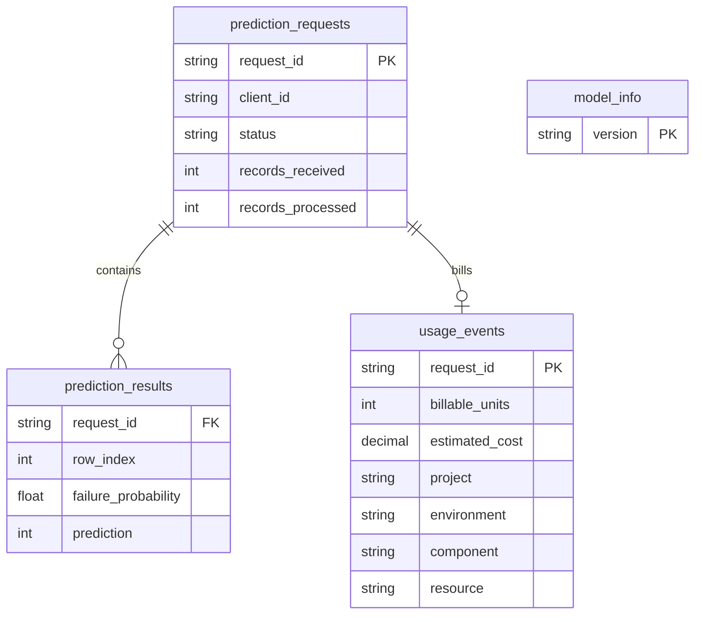

# Esquema SQLite

```mermaid
erDiagram
 prediction_requests ||--o{ prediction_results : contains
 prediction_requests ||--o| usage_events : bills
 model_info { string version PK }
 prediction_requests { string request_id PK string client_id string status int records_received int records_processed }
 prediction_results { string request_id FK int row_index float failure_probability int prediction }
 usage_events { string request_id PK int billable_units decimal estimated_cost string project string environment string component string resource }
```

La base usa WAL, `secure_delete=ON`, FK con cascada y volumen Docker `mantenia_db`. La migración añade columnas de tags y cliente a volúmenes existentes sin borrar datos.
