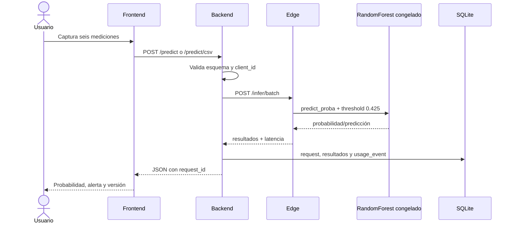

# Secuencia E2E

```mermaid
sequenceDiagram
  actor U as Usuario
  participant F as Frontend
  participant B as Backend
  participant E as Edge
  participant M as RandomForest congelado
  participant D as SQLite
  U->>F: Captura seis mediciones
  F->>B: POST /predict o /predict/csv
  B->>B: Valida esquema y client_id
  B->>E: POST /infer/batch
  E->>M: predict_proba + threshold 0.425
  M-->>E: probabilidad/predicción
  E-->>B: resultados + latencia
  B->>D: request, resultados y usage_event
  B-->>F: JSON con request_id
  F-->>U: Probabilidad, alerta y versión
```

El CSV sigue el mismo camino; `parse_csv` limita a 1000 filas y rechaza columnas, tipos o valores fuera del contrato.
